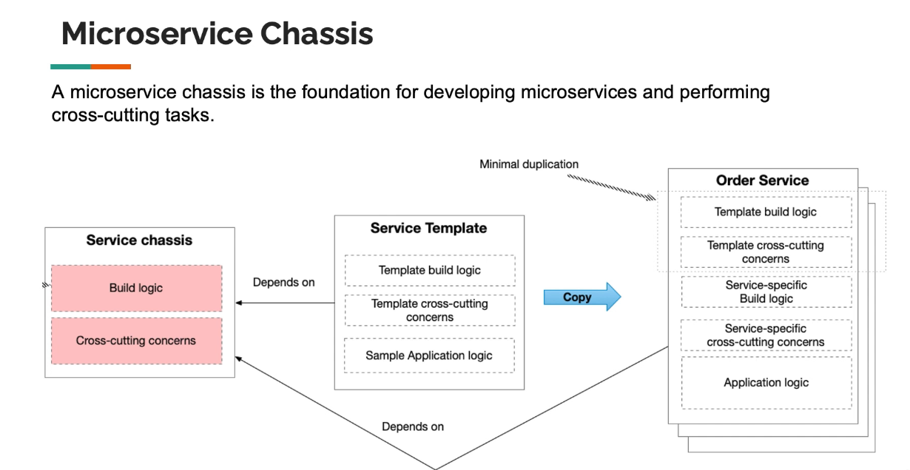

# Types of Microservices

## Microservices Chassis

A microservices chassis is a foundational framework or template that provides the essential components and structure needed to build, deploy, and manage microservices. It typically includes pre-configured libraries, tools, and best practices that help developers create microservices more efficiently and consistently. A microservices chassis may offer features such as service discovery, configuration management, logging, monitoring, and security, allowing developers to focus on implementing business logic rather than dealing with infrastructure concerns.

- Security: Implementing security measures such as authentication, authorization, and encryption to protect microservices from unauthorized access and data breaches.
- external configuration: Managing configuration settings externally to allow for dynamic updates without redeploying services.
- logging and monitoring: Providing built-in logging and monitoring capabilities to track service performance, errors, and usage patterns.
- health checks: Implementing health check endpoints to monitor the status and availability of microservices.
- Tracing: Enabling distributed tracing to track requests as they flow through multiple microservices, helping to identify bottlenecks and performance issues.

```architecture
Order Service | Consumer Service | ...Service
                 |
           Service Template
             Build Logic
                 |
           Service template
       cross cutting concerns
                 |
            Service-specific
             Build Logic
                 |
            Service-specific
        cross cutting concerns
                 |
            Application Logic
```



```architecture
            Client (Web/Mobile)
                 |
              Firewall
                 |
            API Gateway
          /      |      \
        /        |        \
   Product MS  Order MS   Cart MS  Payment MS
      |           |         |        |
   Database    Database   Database  Database
      |           |         |        |
   Event Bus   Event Bus  Event Bus Event Bus
```

## Types of Microservices (Chassis and Templates)

1. **Serverless Microservices**:

   - Built using serverless computing platforms like AWS Lambda, Azure Functions, or Google Cloud Functions.
   - Automatically scale based on demand and charge based on actual usage.
   - Ideal for event-driven architectures and short-lived tasks.
   - Specific to cloud environments.
   - The cloud provider i.e., Aws also provides the Chassis(template, cross-cutting concerns) for building serverless microservices.
   - Scaling-out is based on usage and is done and fully controlled by the cloud provider (AWS, Azure, GCP, etc).
   - Fully integrated with other AWS services i.e., API Gateway, DynamoDB, S3, IAM, CloudWatch, etc.
   - We do not have access to the execution environment (OS, runtime, etc).
   - Development Languages/frameworks supported are limited to what the cloud provider supports.

   ```architecture
   [Client] --> [API Gateway] --> [Lambda Function] --> [Database]
   ```

2. **Containerized Microservices**:

   - The application and its Operating System are packaged into one image i,e., a Docker image or container.
   - must be deployed on a container orchestration platform like Kubernetes, Docker Swarm, or Amazon ECS.
   - Packaged in lightweight, portable containers using technologies like Docker and orchestrated with Kubernetes or Docker Swarm.
   - Provide consistent environments across development, testing, and production.
   - Suitable for complex applications requiring fine-grained control over the runtime environment.
   - Can be deployed on-premises or in the cloud.
   - The container orchestration platform (Kubernetes, Docker Swarm, etc) provides the Chassis(template, cross-cutting concerns) for building containerized microservices.
   - Scaling-out is based on usage and is done and fully controlled by the orchestration platform (Kubernetes, Docker Swarm, etc).
   - Can be integrated with various services (databases, messaging systems, etc) based on the deployment environment (on-premises or cloud).
   - We have full access to the execution environment (OS, runtime, etc) via ssh into the container.
   - Development Languages/frameworks supported are not limited and can use any language/framework that can run inside a container.
   - can support complex deployment scenarios (multi-container, multi-service, blue/green deployments, etc).

   ```architecture
   [Client] --> [Load Balancer] --> [Container Orchestration Platform] --> [Microservice Container] --> [Database]
   ```

## Other Chassis Types

- Spring Boot (Java): A popular framework for building microservices in Java, providing a wide range of features and integrations.
- Django (Python): A high-level Python web framework that can be used to build microservices with a focus on rapid development and clean design.
- Express.js (Node.js): A minimal and flexible Node.js web application framework that provides a robust set of features for building microservices.
- Flask (Python): A lightweight Python web framework that is easy to use and suitable for building small to medium-sized microservices.
- Ruby on Rails (Ruby): A web application framework written in Ruby that follows the convention over configuration principle, making it easy to develop and deploy microservices.
- .NET Core (C#): A cross-platform framework for building modern, cloud-based, and internet-connected applications.
- Micronaut (Java, Kotlin, Groovy): A JVM-based framework designed for building modular, easily testable microservices.
- Quarkus (Java): A Kubernetes-native Java framework tailored for GraalVM and OpenJDK HotSpot, designed for building cloud-native applications.
- Lagom (Java, Scala): A framework for building reactive microservices in Java or Scala, focusing on simplicity and scalability.
- Helidon (Java): A set of Java libraries for developing microservices, with support for both reactive and traditional programming models.
- Moleculer (Node.js): A modern, open-source microservices framework for Node.js that focuses on simplicity and performance.
- Go Kit (Go): A distributed programming toolkit for building microservices in Go, providing a set of common patterns and best practices.

```architecture
            Client (Web/Mobile)
                 |
              Firewall
                 |
            API Gateway
          /      |      \
        /        |        \
   Product MS  Order MS   Cart MS  Payment MS
      |           |         |        |
   Database    Database   Database  Database
      |           |         |        |
   Event Bus   Event Bus  Event Bus Event Bus
                 |
            Auth service
                |
            [Database]
```

### Microservices in AWS

1. AWS Lambda:

   - the microservice framework(chassis and template) for building serverless microservices in AWS.
   - A serverless compute service that runs code in response to events and automatically manages the underlying compute resources.

2. AWS supports building containerized microservices using:
   - Amazon Elastic Kubernetes Service (EKS): A managed Kubernetes service that makes it easy to run Kubernetes on AWS without needing to install and operate your own Kubernetes control plane or nodes.
   - Amazon Elastic Container Service (ECS): A fully managed container orchestration service that makes it easy to deploy, manage, and scale containerized applications using Docker containers.
   - AWS Fargate: A serverless compute engine for containers that works with both Amazon ECS and Amazon EKS, allowing you to run containers without having to manage the underlying infrastructure.
