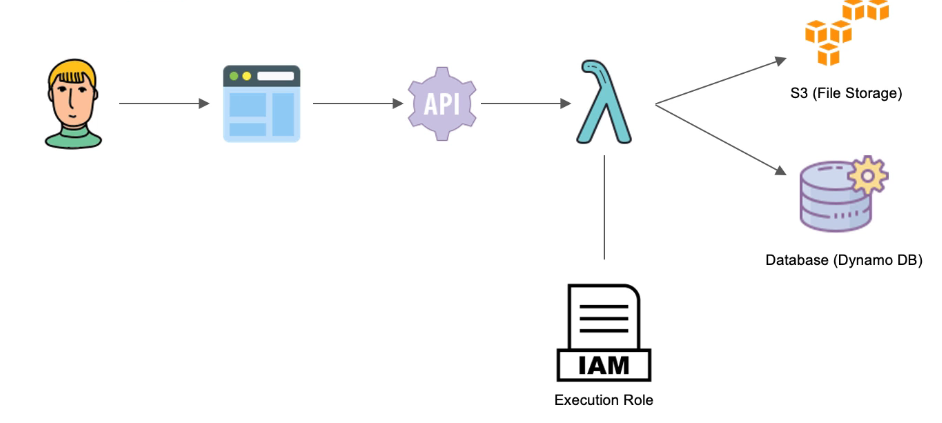

# Storage Mechanism in AWS

- in AWS, there are two major ways to store information:

  - database storage (e.g., DynamoDB, RDS)
  - file storage (e.g., S3)

1. Databases in AWS

- AWS provides several database services, such as DynamoDB, RDS, Aurora, etc.
- there are both relational databases (e.g., RDS, Aurora) and non-relational databases (e.g., DynamoDB, DocumentDB).
- AWS Relational Databases Service (RDS) is a managed service that makes it easy to set up, operate, and scale a relational database in the cloud. it supports several database engines, such as MySQL, PostgreSQL, Oracle, SQL Server, etc.
- AWS DynamoDB is a fully managed NoSQL database service that provides fast and predictable performance with seamless scalability. it is a key-value and document database that delivers single-digit millisecond performance at any scale. Information is stored as JSON documents.
- One RDS (i.e., MySQL) instance for the entire system is ok, however, each microservice must have its own database (i.e., DynamoDB table) to ensure loose coupling and high cohesion.
- no cross-database queries or access are allowed. each microservice is responsible for its own data.

2. File Storage in AWS

- AWS S3 (Simple Storage Service) is an object storage service that offers industry-leading scalability, data availability, security, and performance. it is designed to store and retrieve any amount of data from anywhere on the web.
- AWS EFS (Elastic File System) is a scalable file storage service for use with AWS Cloud services and on-premises resources. it provides a simple, scalable, elastic file system for Linux-based workloads for use with AWS Cloud services and on-premises resources. it is used as disk-as-a-service for EC2 instances for short-term storage.

## Storing data with API Gateway and Lambda



```

User (Client) ---> Hotel Booking (Browser) --- (request with form data) ---> API Gateway -- (forward request) --> AWS Lambda -- (upload image of hotel) --> S3 (file storage)

AWS Lambda -- (store metadata of hotel) --> DynamoDB (database storage)

// aws lambda does not have access to S3 and dynamodb by default. it has access to AWS cloudwatch for logs and execution metrics only. we need to update the `IAM role of the lambda function`, also called execution role, to allow access to S3 and DynamoDB.

```

- storage options: in-memory storage (e.g., Redis) and persistent storage (e.g., S3, DynamoDB)
- in-memory storage is fast but not persistent, meaning that the data is lost when the application is restarted. persistent storage is slower but the data is stored permanently.
- in this example, we will use S3 to store images and DynamoDB to store metadata

- in the previous example, we used in-memory storage to store the data. but in real-world applications, we need to use a persistent storage mechanism to store the data.
- AWS provides several storage options, such as S3, DynamoDB, RDS, etc. for this example, we will use S3 to store the images and DynamoDB to store the metadata.
- we need to create an S3 bucket to store the images. we can use the AWS Management Console or AWS CLI to create the bucket.

```bash
aws s3 mb s3://your-bucket-name
```

- we also need to create a DynamoDB table to store the metadata. we can use the AWS Management Console or AWS CLI to create the table.

```bash
aws dynamodb create-table --table-name your-table-name --attribute-definitions AttributeName=id,AttributeType=S --key-schema AttributeName=id,KeyType=HASH --billing-mode PAY_PER_REQUEST
```

- we need to install the AWS SDK for .NET to interact with S3 and DynamoDB.

```bash
dotnet add package AWSSDK.S3
dotnet add package AWSSDK.DynamoDBv2
```

- we can use the `AmazonS3Client` class to upload the images to S3 and the `AmazonDynamoDBClient` class to store the metadata in DynamoDB. here's an example of how to do this in a Lambda function:

```csharp
var s3Client = new AmazonS3Client();
var dynamoDbClient = new AmazonDynamoDBClient();
var bucketName = "your-bucket-name";
var tableName = "your-table-name";
var file = formData.Files.FirstOrDefault();
var fileName = file?.Name;
var fileKey = $"{Guid.NewGuid()}_{fileName}";
using (var fileStream = file.Data)
{
    var putRequest = new PutObjectRequest
    {
        BucketName = bucketName,
        Key = fileKey,
        InputStream = fileStream,
        ContentType = file.ContentType
    };
    await s3Client.PutObjectAsync(putRequest);
}

var item = new Dictionary<string, AttributeValue>
{
    { "id", new AttributeValue { S = Guid.NewGuid().ToString() } },
    { "hotelName", new AttributeValue { S = hotelName } },
    { "hotelRating", new AttributeValue { N = hotelRating } },
    { "hotelCity", new AttributeValue { S = hotelCity } },
    { "hotelPrice", new AttributeValue { N = hotelPrice } },
    { "imageUrl", new AttributeValue { S = $"https://{bucketName}.s3.amazonaws.com/{fileKey}" } }
};

var putItemRequest = new PutItemRequest
{
    TableName = tableName,
    Item = item
};

await dynamoDbClient.PutItemAsync(putItemRequest);
```

- in this example, we create an S3 client and a DynamoDB client. we upload the image to S3 using the `PutObjectAsync` method and store the metadata in DynamoDB using the `PutItemAsync` method.
- we generate a unique key for the image using `Guid.NewGuid()` to avoid name collisions in the S3 bucket.
- we construct the image URL using the bucket name and the file key to store it in DynamoDB.
- make sure to replace `your-bucket-name` and `your-table-name` with the actual names of your S3 bucket and DynamoDB table.
- we also need to update the IAM role of the Lambda function to allow access to S3 and DynamoDB. we can do this by attaching the following policies to the role:

```json
{
  "Version": "2012-10-17",
  "Statement": [
    {
      "Effect": "Allow",
      "Action": ["s3:PutObject", "s3:GetObject"],
      "Resource": "arn:aws:s3:::your-bucket-name/*"
    },
    {
      "Effect": "Allow",
      "Action": ["dynamodb:PutItem", "dynamodb:GetItem"],
      "Resource": "arn:aws:dynamodb:your-region:your-account-id:table/your-table-name"
    }
  ]
}
```

- make sure to replace `your-bucket-name`, `your-region`, `your-account-id`, and `your-table-name` with the actual values.
- this policy allows the Lambda function to put and get objects from the specified S3 bucket and to put and get items from the specified DynamoDB table.
- with this setup, we can now store images in S3 and metadata in DynamoDB, providing a persistent storage mechanism for our application.
- we need to install the `System.IdentityModel.Tokens.Jwt` package to deserialize the JSON Web Token (JWT) and read the claims.

```bash
dotnet add package System.IdentityModel.Tokens.Jwt
```

- once installed, we can use the `JwtSecurityToken` class to read the claims from the token. here's an example of how to do this in a Lambda function:

```csharp
var token = new JwtSecurityToken(idToken); // we can also use JwtSecurityToken class directly
var group = token.Claims.FirstOrDefault(x => x.Type == "cognito:group"); // to get the group claim
if (group == null || group.Value != "Admin")
{
    response.StatusCode = (int)HttpStatusCode.Unauthorized;
    // Log the unauthorized access attempt
    // serialize the response body to json
    response.Body = JsonSerializer.Serialize(new
    {
        Error = "Unauthorized, Must be a member of Admin Group."
    });
}
```

- we can use the email claim to identify the user and authorize the request. for example, we can check if the email is in the list of authorized users.

```csharp
var authorizedEmails = new List<string> { "user1@example.com", "user2@example.com" };
var email = token.Claims.FirstOrDefault(x => x.Type == "email")?.Value;
if (email == null || !authorizedEmails.Contains(email))
{
    response.StatusCode = (int)HttpStatusCode.Unauthorized;
    // Log the unauthorized access attempt
    // serialize the response body to json
    response.Body = JsonSerializer.Serialize(new
    {
        Error = "Unauthorized, Must be an authorized user."
    });
}
```

- if the email is not in the list, we return a 401 Unauthorized response. otherwise, we proceed with processing the request.
- we can also check if the userId from the form data matches the email claim from the token to ensure that the user is authorized to perform the action.

```csharp
var userId = formData["userId"];
if (userId != email)
{
    response.StatusCode = (int)HttpStatusCode.Unauthorized;
    // Log the unauthorized access attempt
    // serialize the response body to json
    response.Body = JsonSerializer.Serialize(new
    {
        Error = "Unauthorized, User ID does not match email claim."
    });
}
```

- if the userId does not match the email claim, we return a 403 Forbidden response. otherwise, we proceed with processing the request.
- this way, we can ensure that only authorized users can perform certain actions in our Lambda function
- we can also use AWS IAM roles and policies to manage access to S3 and DynamoDB. for example, we can create a role that has read-only access to S3 and DynamoDB and assign it to users who only need to view the data.
- we can also use AWS Cognito to manage user authentication and authorization. we can create a user pool and an identity pool in Cognito and use them to authenticate users and authorize access to S3 and DynamoDB.
- we can use Cognito groups to manage user roles and permissions. for example, we can
  create an Admin group that has full access to S3 and DynamoDB and a User group that has read-only access.
- we can assign users to different groups based on their roles and permissions. this way, we can easily manage access to S3 and DynamoDB based on user roles.
- we can also use AWS Lambda authorizers to implement custom authorization logic for our API Gateway endpoints. for example, we can create a Lambda function that checks if the user is in the Admin group before allowing access to certain endpoints.
- this way, we can ensure that only authorized users can access certain resources in our application.
- we can also implement logging and monitoring for our Lambda function to track access and usage. we can use AWS CloudWatch to monitor the function's performance and log any errors or exceptions.
- we can also use AWS CloudTrail to track API calls and monitor access to S3 and
  DynamoDB. this way, we can ensure that our application is secure and compliant with any regulatory requirements.
- by using S3 and DynamoDB as our storage mechanism, we can ensure that our application is scalable, reliable, and secure. we can easily store and retrieve images and metadata, and we can manage access to the data based on user roles and permissions.
- this approach allows us to build a robust and secure microservices architecture using AWS services.
- we can also implement caching to improve the performance of our application. we can use AWS ElastiCache to cache frequently accessed data and reduce the number of requests to DynamoDB.
- we can also use AWS CloudFront to cache images stored in S3 and deliver them to users with low latency. this way, we can improve the user experience and reduce the load on our backend services.
- by implementing caching, we can further enhance the performance and scalability of our application.
